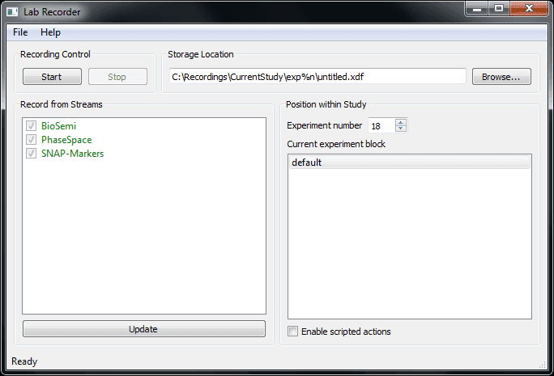

[](https://travis-ci.org/labstreaminglayer/App-LabRecorder)
[](https://ci.appveyor.com/project/cboulay/app-labrecorder)

# Overview

The LabRecorder is the default recording program that comes with LSL. It allows to record all streams on the lab network (or a subset) into a single file, with time synchronization between streams.

# File Format

The file format used by the LabRecorder is XDF. This is an open general-purpose format that was designed concurrently with LSL and supports all features of LSL streams. The project page is [here](https://github.com/sccn/xdf). There are importers for MATLAB, EEGLAB, BCILAB, Python, and MoBILAB.

# Getting LabRecorder

The [releases page](https://github.com/labstreaminglayer/App-LabRecorder/releases) contains archives of past LabRecorder builds. Try downloading and installing an archive that matches your platform. Note for Ubuntu users: The deb will install LabRecorder to `/usr/LabRecorder` though we might change this to `/usr/local/bin/LabRecorder` in the future.

If there are no archives matching your target platform, or the ones available don't run, then continue reading below. If the instructions don't help then please post an issue to the [repo's issues page](https://github.com/labstreaminglayer/App-LabRecorder/issues).

## Dependencies

For LabRecorder to work on your system, you might need to first install some dependencies, specifically liblsl and optionally Qt.

### Windows

The Windows archives ship with all required dependencies. If you suspect you are missing a dependency, try running [Dependencies.exe](https://github.com/lucasg/Dependencies/releases) then navigating to the LabRecorder.exe. It's important to launch Dependencies.exe from the same environment that you would use to launch this application: if you launch this application by double-clicking the executable in Windows' finder then do the same on the Dependencies.exe icon; if you launch this application in a Terminal window, then use that same Terminal to launch Dependencies.

### MacOS

In the near future, many LSL Apps (especially LabRecorder) will not ship with their dependencies and will look for the dependencies to be installed on the system. The easiest way to manage the dependencies is by using [homebrew](https://brew.sh/):
* Install homebrew: `/bin/bash -c "$(curl -fsSL https://raw.githubusercontent.com/Homebrew/install/HEAD/install.sh)"`
* `brew install labstreaminglayer/tap/lsl`
* `brew install qt`

You can then install LabRecorder directly from homebrew: `brew install labrecorder`

Run it with `open /usr/local/opt/labrecorder/LabRecorder/LabRecorder.app`

### Linux Ubuntu

The Ubuntu releases do not typically ship with their dependencies, so you must download and install those:
* Download, extract, and install the latest [liblsl-{version}-{target}_amd64.deb from its release page](https://github.com/sccn/liblsl/releases)
    * We hope to make this available via a package manager soon.
      * Quick ref Ubuntu 20.04: `curl -L https://github.com/sccn/liblsl/releases/download/v1.16.0/liblsl-1.16.0-bionic_amd64.deb -o liblsl.deb`
      * Quick ref Ubuntu 22.04: `curl -L https://github.com/sccn/liblsl/releases/download/v1.16.0/liblsl-1.16.0-jammy_amd64.deb -o liblsl.deb`
    * You can install liblsl directly by double-clicking on the deb, or with `sudo dpkg -i {filename}.deb` or `sudo apt install {filename}.deb`
* See the bottom of the [lsl build env docs](https://labstreaminglayer.readthedocs.io/dev/build_env.html).
    * For most cases, this will amount to installing Qt and its dependencies:
      * Ubuntu 18.xx or 20.xx: `sudo apt-get install build-essential qtbase5-dev libpugixml-dev`
      * Ubuntu >= 22.04: `sudo apt-get install qt6-base-dev freeglut3-dev`

# Usage

The LabRecorder displays a list of currently present device streams under "Record from Streams". If you have turned on a device after you have already started the recorder, click the "Update" button to update the list (this takes ca. 2 seconds).
> For testing, you can use a "dummy" device from the `lslexamples` found in the [liblsl release assets](https://github.com/sccn/liblsl/releases) (for example SendData<!--, SendStringMarkers, and SendDataSimple-->).

If you cannot see streams that are provided on another computer, read the section Network Troubleshooting on the NetworkConnectivity page.

You can select which streams you want to record from and which not by checking the checkboxes next to them.
> 

Note that if you have multiple streams with the same name and host, it is impossible to check only 1. If any is checked then they will all be recorded.

The entry in "Saving to..." shows you the file name (or file name template) where your recording will be stored. You can change this by modifying the Study Root folder (e.g., by clicking the browse button) and the `File Name / Template` field. If the respective directory does not yet exist, it will be created automatically (except if you do not have the permissions to create it). The file name string may contain placeholders that will be replaced by the values in the fields below. Checking the BIDS box will automatically change the filename template to be BIDS compliant. If the file that you are trying to record to already exists, the existing file will be renamed (the string `_oldX` will be appended where X is the lowest number that is not yet occupied by another existing file). This way, it is impossible to accidentally overwrite data.

The Block/Task field can be overwriten or selected among a list of items found in the configuration file.

<!--If the checkbox "Enable scripted actions" is checked, then scripted actions that are defined in your current config file will be automatically invoked when you click Start, Stop, or select a block. This check box is by normally unchecked unless you have custom-tailored a configuration to your experiment or experimentation environment.-->

Click "Start" to start a recording. If everything goes well, the status bar will now display the time since you started the recording, and more importantly, the current file size (the number before the kb) will grow slowly. This is a way to check whether you are still in fact recording data. The recording program cannot be closed while you are recording (as a safety measure).

When you are done recording, click the "Stop" button. You can now close the program. See [the xdf repository](https://github.com/sccn/xdf) for tools and information on how to use the XDF files.

## Preparing a Full Study

When preparing a new study, it is a good idea to make a custom configuration file which at least sets up a custom storage location for the study. See the documentation in the file `LabRecorder.cfg` for how to do this -- it is very easy! <!--The file `sample_config.cfg` contains a somewhat more advanced setup for reference. By default, the file `default_config.cfg` is loaded at startup.--> You can override this by making a shortcut for the LabRecorder program (e.g. on the desktop) and appending in its properties the command-line arguments `-c name_of_you_config.cfg`. You can also create a batch script. You can also load the config while the program is already running, but this can easily be forgotten during an experiment, so we recommend to follow the shortcut route.

In addition to the storage location, if your experiment has multiple blocks (e.g., SubjectTraining, PreBaseline, MainBlock, PostBaseline or the like) you can make the recording process even more straightforward for the experimenters by setting up a default list of block names. Again, take a look at the existing config files.

Since it is too easy to forget to turn on or check all necessary recording devices for a study, we recommend to also make a list of "required" streams (by their name) and put it into the config file. These streams will be pre-checked when starting the program, and any missing stream will be displayed in red. If such a stream is still not green when starting the recording, the experimenter will get a message box to confirm that he/she really wants to record without including the device.

<!--Advanced users might consider automating further steps in the recording process (for example starting the experiment script itself), which can be done by assinging scripted actions in the configuration file. The file `sample_config.cfg` contains pre-defined actions to remote-control the SNAP experimentation environment. In particular, when you click a block, the corresponding SNAP .cfg file will be loaded, and when you click start, the module will be started. Keep in mind, however, that homegrown scripted actions carry the risk of accidentally crashing the recording program, so they need to be carefully tested. One subtle consideration is that the module definitions happen in the context of the main class of the LabRecorder.-->

<!--The following picture shows the the recorder fully configured for a particular study. The BioSemi device is displayed in red because it is not yet turned on. The file naming scheme is customized, and there are four blocks pre-configured with associated scripted actions.
> -->

## Remote Control

If you check the box to EnableRCS then LabRecorder exposes some rudimentary controls via TCP socket.

Currently supported commands include:
* `select all`
* `select none`
* `start`
* `stop`
* `update`
* `filename ...`

`filename` is followed by a series of space-delimited options enclosed in curly braces. e.g. {root:C:\root_data_dir}
* `root` - Sets the root data directory.
* `template` - sets the File Name / Template. Will unselect BIDS option. May contain wildcards.
* `task` - will replace %b in template
* `run` - will replace %n in template (not working?)
* `participant` - will replace %p in template
* `session` - will replace %s in template
* `acquisition` - will replace %a in template
* `modality` - will replace %m in template. suggested values: eeg, ieeg, meg, beh


For example, in Python:

```python
import socket
s = socket.create_connection(("localhost", 22345))
s.sendall(b"select all\n")
s.sendall(b"filename {root:C:\\Data\\} {template:exp%n\\%p_block_%b.xdf} {run:2} {participant:P003} {task:MemoryGuided}\n")
s.sendall(b"start\n")
```

```Matlab
lr = tcpip('localhost', 22345); 
fopen(lr)
fprintf(lr, 'select all');
fprintf(lr, ['filename {root:C:\Data\} '...
            '{task:MemoryGuided} ' ...
            '{template:s_%p_%n.xdf ' ...
            '{modality:ieeg}']); 
fprintf(lr, 'start');
```

## Misc Features

The LabRecorder has some useful features that can add robustness if things go wrong during the experiment:

If a network connectivity error happens while recording (e.g., a network cable pops out that connects to the source of a data stream), you have usually 6 minutes (think 5) to plug it back it in during which the data will be buffered on the sending machine. If it takes you longer to fix the problem, you will have some gap in your recording.

If a device program or computer crashes while recording, you will for sure lose data, but any device program that transmits an associated device serial number will be picked up automatically by the recorder when it comes back online (these programs are called "recoverable"), without a need to stop and re-start the recording.

You should check the health of your device to be sure, however, for example using an online stream viewer program (see, for example, ViewingStreamsInMatlab). Also, be sure to test whether it is in fact recoverable before relying on this feature (you can test this with a viewer by turning the device app off and back on).

If a device is displayed in red when you start recording (and it is checked), it will be added to the ongoing recording by the time when it comes online. This can be useful when a device can only be turned on while the recording is already in progress. Again, it is advisable to check that the device is in fact discoverable and added. The LabRecorder brings up a console window in the background which shows a list of all streams that are added to the recording -- this is a good place to check whether a late stream did get picked up successfully during a live recording.

# Build Instructions

Please follow the general [LSL App build instructions](https://labstreaminglayer.readthedocs.io/dev/app_build.html).
